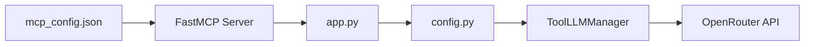

# Plan d'Implémentation - Configuration LLM via MCP Config

## 📋 Objectif
Permettre aux utilisateurs de configurer leur modèle LLM et clé API directement dans la configuration MCP de Windsurf, sans avoir à modifier les fichiers .env ou le code source.

## 🎯 Configuration Cible
```json
{
  "collegue": {
    "serverUrl": "http://localhost:8088/mcp/",
    "LLM_MODEL": "google/gemini-2.0-flash-exp:free",
    "LLM_API_KEY": "sk-or-v1-xxxxx"
  }
}
```

## 🔄 Flux de Données


## 📝 Plan d'Implémentation

### Phase 1: Modification de la Configuration (config.py)
- [ ] Ajouter support pour les variables MCP dans `Config`
- [ ] Créer une méthode `update_from_mcp()` pour surcharger les valeurs
- [ ] Garder la compatibilité avec les variables d'environnement

### Phase 2: Récupération des Paramètres MCP (app.py)
- [ ] Intercepter les paramètres MCP lors de l'initialisation
- [ ] Extraire `LLM_MODEL` et `LLM_API_KEY` des métadonnées
- [ ] Passer ces valeurs à la configuration

### Phase 3: Adaptation du ToolLLMManager
- [ ] Modifier l'initialisation pour accepter des paramètres dynamiques
- [ ] Permettre la mise à jour à chaud de la configuration
- [ ] Gérer les erreurs si les paramètres sont invalides

### Phase 4: Documentation et Validation
- [ ] Documenter le nouveau format de configuration
- [ ] Créer des exemples pour différents providers
- [ ] Ajouter des tests unitaires

## 🛠️ Modifications Techniques

### 1. config.py
```python
class Config(BaseSettings):
    # Existant...
    
    # Nouvelles propriétés pour MCP
    _mcp_llm_model: Optional[str] = None
    _mcp_llm_api_key: Optional[str] = None
    
    def update_from_mcp(self, mcp_params: dict):
        """Met à jour la configuration avec les paramètres MCP"""
        if "LLM_MODEL" in mcp_params:
            self._mcp_llm_model = mcp_params["LLM_MODEL"]
        if "LLM_API_KEY" in mcp_params:
            self._mcp_llm_api_key = mcp_params["LLM_API_KEY"]
    
    @property
    def llm_model(self) -> str:
        """Retourne le modèle LLM (priorité: MCP > env > default)"""
        return self._mcp_llm_model or self.LLM_MODEL
    
    @property
    def llm_api_key(self) -> str:
        """Retourne la clé API (priorité: MCP > env > default)"""
        return self._mcp_llm_api_key or self.LLM_API_KEY
```

### 2. app.py
```python
@app.on_startup
async def on_startup():
    # Récupérer les paramètres MCP si disponibles
    mcp_params = get_mcp_parameters()  # À implémenter
    if mcp_params:
        config.update_from_mcp(mcp_params)
    
    # Réinitialiser le ToolLLMManager avec la nouvelle config
    app_state["llm_manager"] = ToolLLMManager(
        api_key=config.llm_api_key,
        model=config.llm_model
    )
```

### 3. Extraction des Paramètres MCP
FastMCP transmet les paramètres personnalisés via les métadonnées de transport. Il faut:
- Intercepter ces métadonnées lors de l'initialisation
- Les stocker dans l'état de l'application
- Les utiliser pour configurer le LLM

## 🔍 Validation et Tests

### Tests de Configuration
1. **Sans paramètres MCP** : Doit utiliser les variables d'environnement
2. **Avec paramètres MCP** : Doit surcharger les variables d'environnement
3. **Paramètres invalides** : Doit gérer gracieusement les erreurs

### Modèles OpenRouter Populaires
```json
// Gratuits
"google/gemini-2.0-flash-exp:free"
"meta-llama/llama-3.2-11b-vision-instruct:free"

// Économiques
"openai/gpt-4o-mini"
"anthropic/claude-3.5-haiku"

// Performants
"openai/gpt-4o"
"anthropic/claude-3.5-sonnet"
```

## 📚 Documentation Utilisateur

### Configuration Minimale
```json
{
  "collegue": {
    "serverUrl": "http://localhost:8088/mcp/"
  }
}
```
Utilise les variables d'environnement ou les valeurs par défaut.

### Configuration Complète
```json
{
  "collegue": {
    "serverUrl": "http://localhost:8088/mcp/",
    "LLM_MODEL": "openai/gpt-4o-mini",
    "LLM_API_KEY": "sk-or-v1-votre-cle-api"
  }
}
```
Surcharge toutes les configurations par défaut.

## ⚠️ Considérations de Sécurité

1. **Ne jamais logger la clé API** en clair
2. **Valider le format** de la clé API (sk-or-v1-*)
3. **Gérer les erreurs** d'authentification gracieusement
4. **Documenter** que la clé est visible dans le fichier de config

## 🚀 Avantages

- ✅ **Simplicité** : Configuration directe dans Windsurf
- ✅ **Flexibilité** : Chaque utilisateur peut choisir son modèle
- ✅ **Sécurité** : Pas besoin de modifier les fichiers sources
- ✅ **Compatibilité** : Garde le support des variables d'environnement

## 📅 Timeline

1. **Phase 1-2** : 30 minutes - Modification config et app.py
2. **Phase 3** : 15 minutes - Adaptation ToolLLMManager
3. **Phase 4** : 15 minutes - Tests et documentation
4. **Total** : ~1 heure

## 🎯 Critères de Succès

- [ ] Les utilisateurs peuvent configurer leur modèle LLM depuis mcp_config.json
- [ ] Les utilisateurs peuvent configurer leur clé API depuis mcp_config.json
- [ ] La configuration par défaut continue de fonctionner
- [ ] Les variables d'environnement restent supportées
- [ ] La documentation est claire et complète
